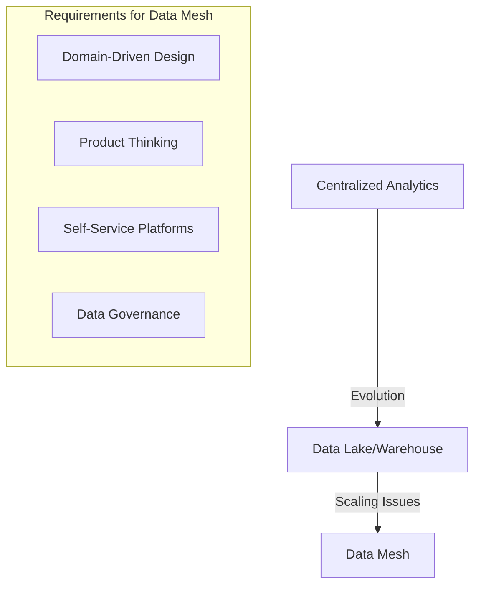

# Data Mesh Architecture

Data mesh represents a paradigm shift in how organizations manage and access analytical data at scale. Unlike traditional centralized approaches, data mesh distributes ownership to domain teams while maintaining global standards.

## Beyond Centralization

Traditional data architectures face significant scaling challenges:

### Limitations of Data Lakes

Centralized data platforms often become bottlenecks:

- Central teams become overwhelmed by domain-specific requests
- Domain knowledge gets lost in translation
- Change management becomes increasingly complex

## Data Mesh Principles

The data mesh approach is built on four key principles:

### Domain Ownership

Data is owned by the domains that understand it best:

1. Product thinking applied to data
2. Self-serve data infrastructure
3. Federated computational governance

## Implementation Challenges

Organizations adopting data mesh face several hurdles:

### Organizational Readiness

Data mesh requires significant organizational maturity:

### Technical Infrastructure

Building the self-serve data platform requires significant investment in tooling and standardization.

<Cards>
  <Card title="Domain-Driven Design" href="/docs/ddd" />
  <Card title="Data Products" href="/docs/data-products" />
</Cards>
